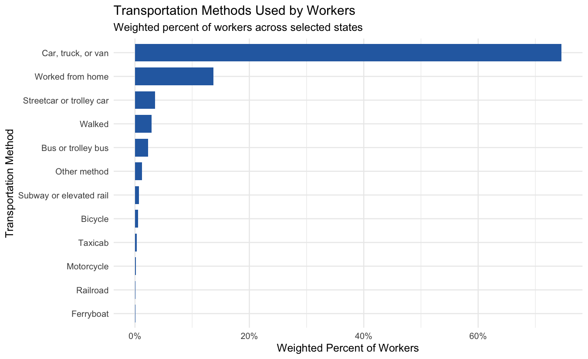
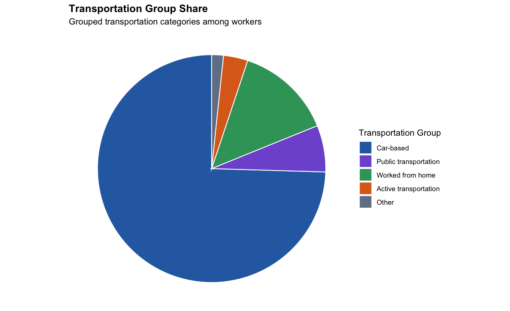
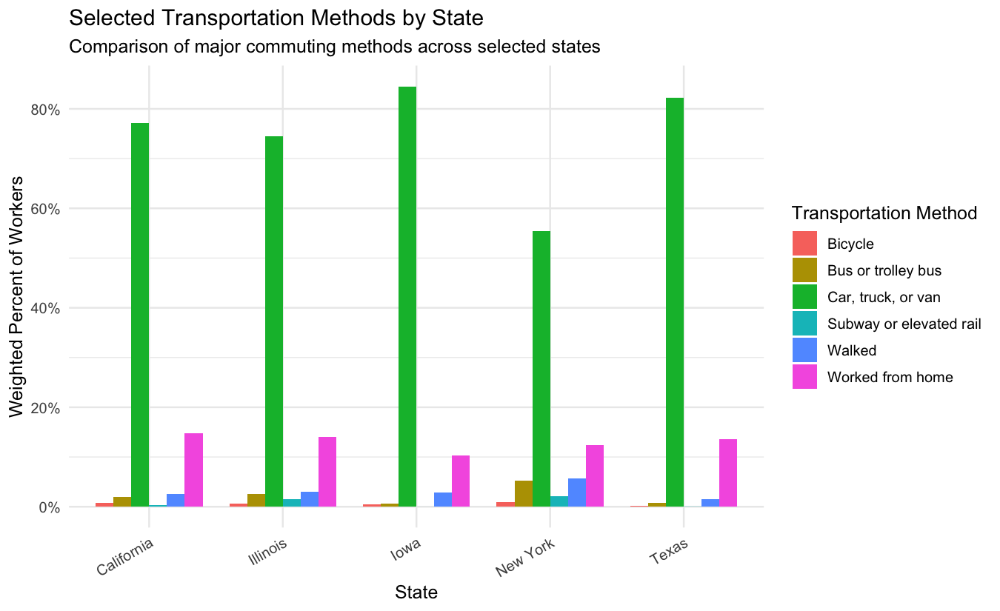
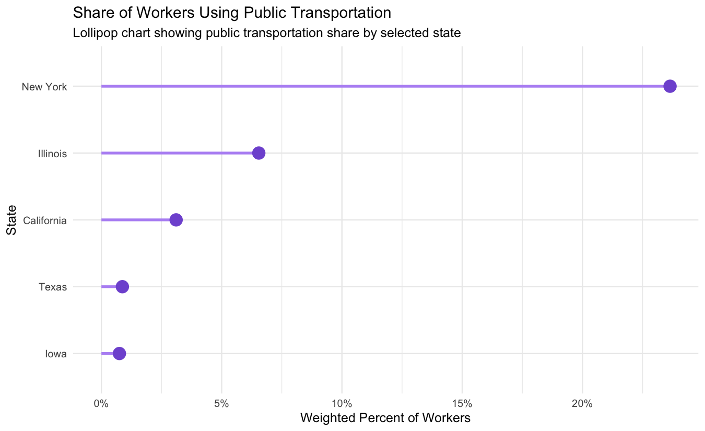
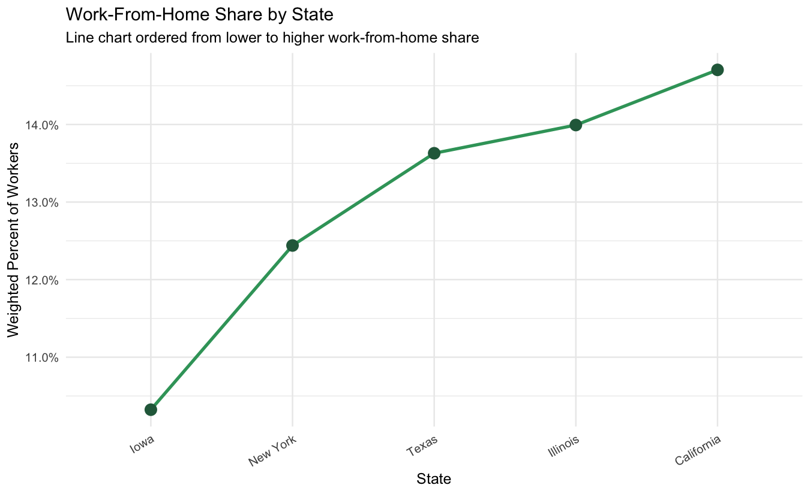
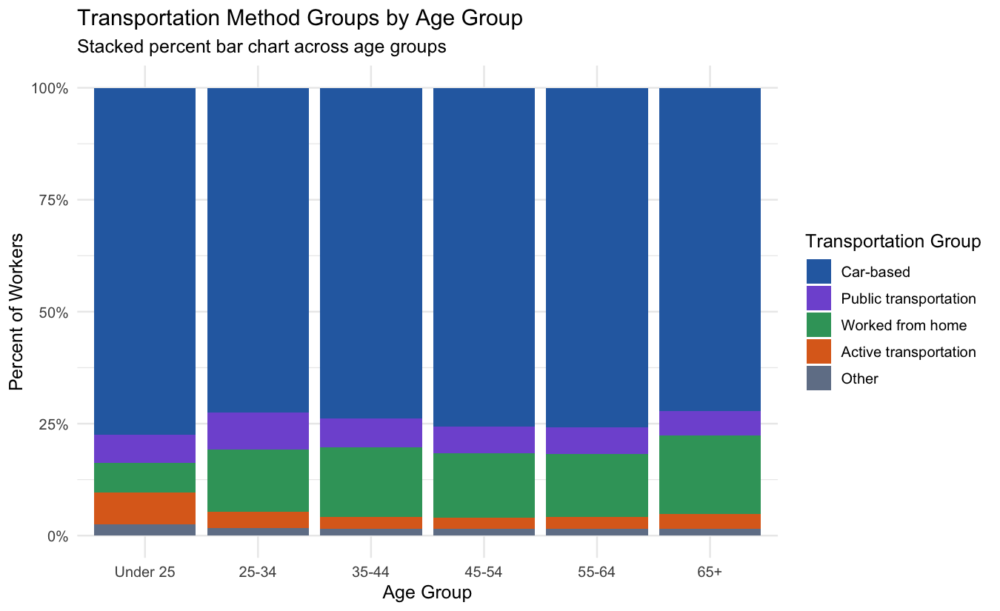
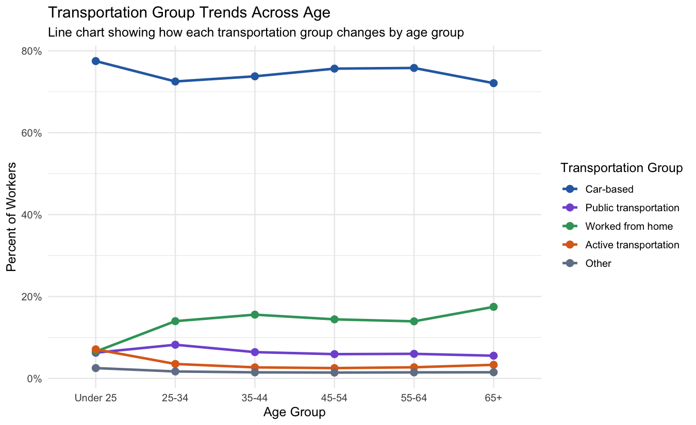
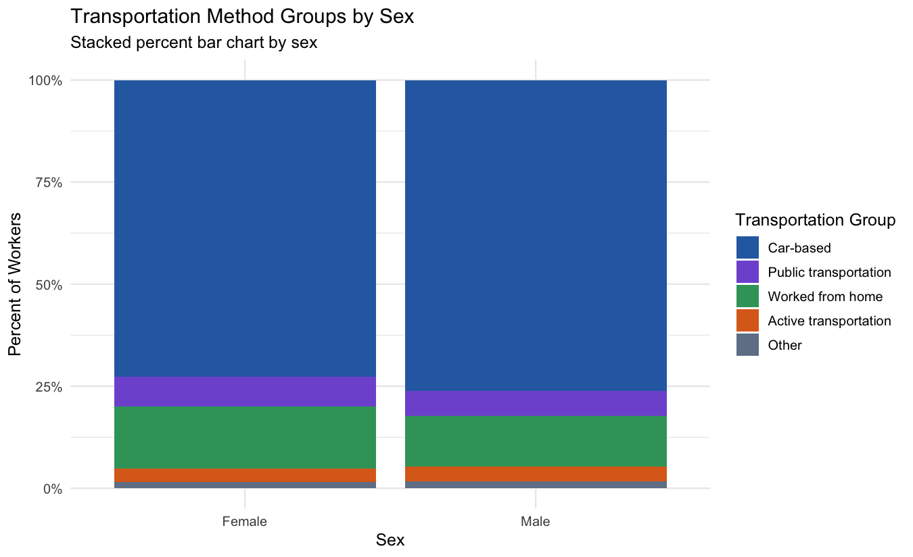
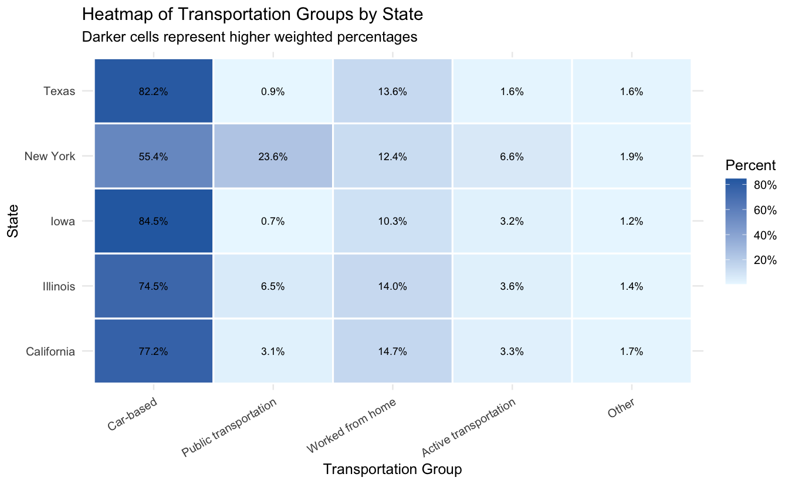

Transportation Methods Used by Workers Across U.S. States
================
Shreya Nallapeta
2026-07-10

``` r
knitr::opts_chunk$set(
  echo = TRUE,
  message = FALSE,
  warning = FALSE,
  fig.width = 9,
  fig.height = 5.5,
  dpi = 150
)

options(scipen = 999)

library(tidyverse)
library(tidycensus)
library(scales)
library(knitr)

theme_set(theme_minimal(base_size = 12))
```

# Introduction

Transportation is part of everyday life for workers. Some workers drive,
some use public transportation, some walk or bike, and some work from
home. These choices can reflect differences in location, public
transportation access, work type, age, sex, and state-level commuting
patterns.

For this final project, I analyze transportation methods used by workers
across selected U.S. states using the American Community Survey Public
Use Microdata Sample, also known as ACS PUMS. The selected states are
Iowa, California, New York, Texas, and Illinois. These states were
chosen because they represent different regions, population patterns,
and transportation environments.

The goal of this project is to explore how workers travel to work and
whether transportation methods differ by state, age group, and sex. This
project is exploratory, so the purpose is not to prove causation, but to
describe patterns and compare groups using clear summaries, tables, and
different types of visualizations.

# Team Member

Shreya Nallapeta

# Research Questions

This project addresses the following questions:

1.  What transportation methods are most commonly used by workers in the
    selected U.S. states?
2.  How do broad transportation groups compare overall?
3.  How do transportation methods differ across Iowa, California, New
    York, Texas, and Illinois?
4.  Which selected state has the highest share of public transportation
    use?
5.  Which selected state has the highest share of workers working from
    home?
6.  How do transportation method groups vary by age group?
7.  How do transportation method groups vary by sex?
8.  What broader visual patterns appear when transportation groups are
    compared across states in a heatmap?

# Project Overview

This final report moves beyond describing the dataset. It uses data
cleaning, ACS person weights, weighted summaries, state-level
comparisons, demographic comparisons, and multiple visualizations to
answer the research questions. The analysis focuses on patterns that are
visible in the data while also explaining uncertainty and limitations.

The report is organized as follows:

1.  Data source, variables, and cleaning
2.  Marginal summaries
3.  Overall transportation patterns
4.  State-level comparisons
5.  Public transportation and work-from-home comparisons
6.  Age-group and sex comparisons
7.  A combined heatmap and supplementary 3D view
8.  Skepticism, limitations, conclusions, and reproducibility

# Data

The dataset used for this project is the **American Community Survey
1-Year Public Use Microdata Sample**, also known as **ACS PUMS**.

Dataset source: U.S. Census Bureau ACS PUMS

Dataset link:
<https://www.census.gov/programs-surveys/acs/microdata.html>

ACS PUMS contains person-level and household-level records. This dataset
is useful for this project because it includes worker characteristics,
commuting method, age, sex, state, and survey weights.

For GitHub submission, the repository includes a smaller cleaned dataset
named `pums_transportation_dataset.csv`. This file is used so the
project can be viewed and reproduced on GitHub without uploading very
large raw Census files. If the smaller file is not available, the R
Markdown file can still download and clean the ACS PUMS data using
`tidycensus`.

This dataset is appropriate for exploratory data analysis because:

- It is recent.
- It contains more than 1,000 observations.
- It includes categorical variables such as transportation method,
  transportation group, sex, age group, and state.
- It includes numeric variables such as age and person-level survey
  weight.
- It comes from an official government data source.
- It fits the topic because commuting method is directly measured in ACS
  PUMS.

# Variables Used

The main variables used in this project are:

| Variable               | Description                     |
|------------------------|---------------------------------|
| `state_label`          | Full state name                 |
| `transportation`       | Recoded transportation method   |
| `transportation_group` | Broader transportation category |
| `age_group`            | Worker age group                |
| `sex_label`            | Recoded sex label               |
| `AGEP`                 | Age                             |
| `PWGTP`                | Person-level survey weight      |

The main response variable is `transportation`, which describes the
worker’s usual means of transportation to work.

# Data Loading and Cleaning

The code first checks whether the GitHub-friendly dataset
`pums_transportation_dataset.csv` exists in the project folder. If it
exists, the report uses that cleaned file. If it does not exist, the
report checks for a local cleaned file in the `data` folder. If neither
file exists, the report downloads ACS PUMS data using `tidycensus` and
performs the cleaning steps.

A Census API key may be required for the first download. The key should
be installed locally in RStudio and should not be written directly in
this file or uploaded to GitHub.

``` r
acs_year <- 2023
selected_states <- c("IA", "CA", "NY", "TX", "IL")

dir.create("data", showWarnings = FALSE)

github_dataset_file <- "pums_transportation_dataset.csv"
raw_file <- "data/pums_raw_selected_states.csv"
clean_file <- "data/pums_clean_transportation.csv"

public_transit_methods <- c(
  "Bus or trolley bus",
  "Streetcar or trolley car",
  "Subway or elevated rail",
  "Railroad",
  "Ferryboat"
)

transportation_colors <- c(
  "Car-based" = "#2b6cb0",
  "Public transportation" = "#805ad5",
  "Active transportation" = "#dd6b20",
  "Worked from home" = "#38a169",
  "Other" = "#718096"
)

if (file.exists(github_dataset_file)) {
  pums_clean <- read_csv(github_dataset_file, show_col_types = FALSE)
  pums_raw <- pums_clean

} else if (file.exists(clean_file)) {
  pums_clean <- read_csv(clean_file, show_col_types = FALSE)
  pums_raw <- pums_clean

} else {
  pums_raw <- map_dfr(
    selected_states,
    function(state_name) {
      get_pums(
        variables = c("JWTRNS", "AGEP", "SEX", "PWGTP", "ESR"),
        survey = "acs1",
        year = acs_year,
        state = state_name,
        recode = FALSE
      ) %>%
        mutate(state_abbr = state_name)
    }
  )

  write_csv(pums_raw, raw_file)

  state_lookup <- tibble(
    state_abbr = c("IA", "CA", "NY", "TX", "IL"),
    state_label = c("Iowa", "California", "New York", "Texas", "Illinois")
  )

  pums_clean <- pums_raw %>%
    mutate(
      JWTRNS_clean = stringr::str_pad(as.character(JWTRNS), width = 2, pad = "0"),
      SEX_clean = as.character(SEX)
    ) %>%
    left_join(state_lookup, by = "state_abbr") %>%
    filter(!is.na(JWTRNS_clean)) %>%
    filter(JWTRNS_clean %in% c("01", "02", "03", "04", "05", "06", "07", "08", "09", "10", "11", "12")) %>%
    filter(AGEP >= 16) %>%
    mutate(
      transportation = case_when(
        JWTRNS_clean == "01" ~ "Car, truck, or van",
        JWTRNS_clean == "02" ~ "Bus or trolley bus",
        JWTRNS_clean == "03" ~ "Streetcar or trolley car",
        JWTRNS_clean == "04" ~ "Subway or elevated rail",
        JWTRNS_clean == "05" ~ "Railroad",
        JWTRNS_clean == "06" ~ "Ferryboat",
        JWTRNS_clean == "07" ~ "Taxicab",
        JWTRNS_clean == "08" ~ "Motorcycle",
        JWTRNS_clean == "09" ~ "Bicycle",
        JWTRNS_clean == "10" ~ "Walked",
        JWTRNS_clean == "11" ~ "Worked from home",
        JWTRNS_clean == "12" ~ "Other method",
        TRUE ~ "Unknown"
      ),
      sex_label = case_when(
        SEX_clean == "1" ~ "Male",
        SEX_clean == "2" ~ "Female",
        TRUE ~ "Unknown"
      ),
      age_group = case_when(
        AGEP < 25 ~ "Under 25",
        AGEP >= 25 & AGEP < 35 ~ "25-34",
        AGEP >= 35 & AGEP < 45 ~ "35-44",
        AGEP >= 45 & AGEP < 55 ~ "45-54",
        AGEP >= 55 & AGEP < 65 ~ "55-64",
        AGEP >= 65 ~ "65+",
        TRUE ~ "Unknown"
      ),
      transportation_group = case_when(
        transportation == "Car, truck, or van" ~ "Car-based",
        transportation %in% public_transit_methods ~ "Public transportation",
        transportation %in% c("Walked", "Bicycle") ~ "Active transportation",
        transportation == "Worked from home" ~ "Worked from home",
        TRUE ~ "Other"
      )
    )

  write_csv(pums_clean, clean_file)
}

pums_clean <- pums_clean %>%
  mutate(
    state_label = as.factor(state_label),
    transportation = as.factor(transportation),
    transportation_group = factor(
      transportation_group,
      levels = c("Car-based", "Public transportation", "Worked from home", "Active transportation", "Other")
    ),
    age_group = factor(
      age_group,
      levels = c("Under 25", "25-34", "35-44", "45-54", "55-64", "65+")
    ),
    sex_label = as.factor(sex_label)
  )
```

# First Look at the Data

``` r
glimpse(pums_raw)
```

    ## Rows: 494,051
    ## Columns: 17
    ## $ SERIALNO             <chr> "2023GQ0001677", "2023GQ0002245", "2023GQ0002565"…
    ## $ SPORDER              <dbl> 1, 1, 1, 1, 1, 1, 1, 1, 1, 1, 1, 1, 1, 1, 1, 1, 1…
    ## $ WGTP                 <dbl> 0, 0, 0, 0, 0, 0, 0, 0, 0, 0, 0, 0, 0, 0, 0, 0, 0…
    ## $ PWGTP                <dbl> 8, 77, 50, 65, 5, 38, 81, 17, 31, 6, 13, 39, 4, 6…
    ## $ AGEP                 <dbl> 57, 19, 18, 18, 18, 19, 21, 21, 56, 20, 21, 20, 2…
    ## $ STATE                <chr> "19", "19", "19", "19", "19", "19", "19", "19", "…
    ## $ JWTRNS               <chr> "01", "10", "01", "01", "01", "01", "10", "10", "…
    ## $ SEX                  <dbl> 2, 1, 1, 2, 1, 1, 2, 2, 1, 2, 2, 1, 2, 1, 2, 2, 2…
    ## $ ESR                  <dbl> 1, 1, 1, 1, 1, 1, 1, 1, 1, 1, 1, 1, 1, 1, 1, 1, 1…
    ## $ state_abbr           <chr> "IA", "IA", "IA", "IA", "IA", "IA", "IA", "IA", "…
    ## $ JWTRNS_clean         <chr> "01", "10", "01", "01", "01", "01", "10", "10", "…
    ## $ SEX_clean            <dbl> 2, 1, 1, 2, 1, 1, 2, 2, 1, 2, 2, 1, 2, 1, 2, 2, 2…
    ## $ state_label          <chr> "Iowa", "Iowa", "Iowa", "Iowa", "Iowa", "Iowa", "…
    ## $ transportation       <chr> "Car, truck, or van", "Walked", "Car, truck, or v…
    ## $ sex_label            <chr> "Female", "Male", "Male", "Female", "Male", "Male…
    ## $ age_group            <chr> "55-64", "Under 25", "Under 25", "Under 25", "Und…
    ## $ transportation_group <chr> "Car-based", "Active transportation", "Car-based"…

``` r
raw_row_count <- nrow(pums_raw)
cleaned_row_count <- nrow(pums_clean)

tibble(
  dataset_stage = c("File used for report", "Analysis dataset"),
  rows = c(raw_row_count, cleaned_row_count)
) %>%
  mutate(rows = comma(rows)) %>%
  kable()
```

| dataset_stage        | rows    |
|:---------------------|:--------|
| File used for report | 494,051 |
| Analysis dataset     | 494,051 |

The analysis dataset contains 494,051 rows with valid transportation
information.

# Cleaning Steps

The data cleaning process includes the following steps:

1.  Kept records with valid transportation method values.
2.  Kept workers age 16 and older.
3.  Recoded transportation method codes into readable labels.
4.  Recoded sex into readable labels.
5.  Recoded state abbreviations into full state names.
6.  Created age groups.
7.  Used person weights for weighted summaries.
8.  Created broader transportation groups for easier comparison.

# Marginal Summaries

## Numeric Summary

``` r
pums_clean %>%
  summarise(
    number_of_records = n(),
    minimum_age = min(AGEP, na.rm = TRUE),
    median_age = median(AGEP, na.rm = TRUE),
    mean_age = mean(AGEP, na.rm = TRUE),
    maximum_age = max(AGEP, na.rm = TRUE),
    mean_person_weight = mean(PWGTP, na.rm = TRUE)
  ) %>%
  mutate(
    number_of_records = comma(number_of_records),
    mean_age = round(mean_age, 1),
    mean_person_weight = round(mean_person_weight, 1)
  ) %>%
  kable()
```

| number_of_records | minimum_age | median_age | mean_age | maximum_age | mean_person_weight |
|:---|---:|---:|---:|---:|---:|
| 494,051 | 16 | 43 | 43.4 | 95 | 102.7 |

## State Summary

``` r
state_summary <- pums_clean %>%
  group_by(state_label) %>%
  summarise(
    unweighted_count = n(),
    weighted_workers = sum(PWGTP, na.rm = TRUE),
    .groups = "drop"
  ) %>%
  mutate(
    weighted_percent = weighted_workers / sum(weighted_workers)
  ) %>%
  arrange(desc(weighted_workers))

state_summary %>%
  mutate(
    weighted_workers = comma(weighted_workers),
    weighted_percent = percent(weighted_percent, accuracy = 0.1)
  ) %>%
  kable()
```

| state_label | unweighted_count | weighted_workers | weighted_percent |
|:------------|-----------------:|:-----------------|:-----------------|
| California  |           182401 | 18,677,664       | 36.8%            |
| Texas       |           139512 | 14,806,386       | 29.2%            |
| New York    |            95216 | 9,419,997        | 18.6%            |
| Illinois    |            61206 | 6,222,333        | 12.3%            |
| Iowa        |            15716 | 1,623,722        | 3.2%             |

## Sex Summary

``` r
sex_summary <- pums_clean %>%
  group_by(sex_label) %>%
  summarise(
    unweighted_count = n(),
    weighted_workers = sum(PWGTP, na.rm = TRUE),
    .groups = "drop"
  ) %>%
  mutate(
    weighted_percent = weighted_workers / sum(weighted_workers)
  )

sex_summary %>%
  mutate(
    weighted_workers = comma(weighted_workers),
    weighted_percent = percent(weighted_percent, accuracy = 0.1)
  ) %>%
  kable()
```

| sex_label | unweighted_count | weighted_workers | weighted_percent |
|:----------|-----------------:|:-----------------|:-----------------|
| Female    |           235140 | 23,688,297       | 46.7%            |
| Male      |           258911 | 27,061,805       | 53.3%            |

## Age Group Summary

``` r
age_summary <- pums_clean %>%
  group_by(age_group) %>%
  summarise(
    unweighted_count = n(),
    weighted_workers = sum(PWGTP, na.rm = TRUE),
    .groups = "drop"
  ) %>%
  mutate(
    weighted_percent = weighted_workers / sum(weighted_workers)
  )

age_summary %>%
  mutate(
    weighted_workers = comma(weighted_workers),
    weighted_percent = percent(weighted_percent, accuracy = 0.1)
  ) %>%
  kable()
```

| age_group | unweighted_count | weighted_workers | weighted_percent |
|:----------|-----------------:|:-----------------|:-----------------|
| Under 25  |            56758 | 6,222,130        | 12.3%            |
| 25-34     |           103668 | 11,686,655       | 23.0%            |
| 35-44     |           104079 | 11,485,967       | 22.6%            |
| 45-54     |            98821 | 10,062,876       | 19.8%            |
| 55-64     |            90095 | 8,091,388        | 15.9%            |
| 65+       |            40630 | 3,201,086        | 6.3%             |

# Main Results

## Result 1: What transportation methods are most common?

The first analysis examines the overall weighted distribution of
transportation methods. The table provides exact weighted counts and
percentages, while the chart makes the ranking of methods easier to
compare visually.

``` r
transportation_summary <- pums_clean %>%
  group_by(transportation) %>%
  summarise(
    unweighted_count = n(),
    weighted_workers = sum(PWGTP, na.rm = TRUE),
    .groups = "drop"
  ) %>%
  mutate(
    weighted_percent = weighted_workers / sum(weighted_workers)
  ) %>%
  arrange(desc(weighted_workers))

transportation_summary %>%
  mutate(
    weighted_workers = comma(weighted_workers),
    weighted_percent = percent(weighted_percent, accuracy = 0.1)
  ) %>%
  kable()
```

| transportation           | unweighted_count | weighted_workers | weighted_percent |
|:-------------------------|-----------------:|:-----------------|:-----------------|
| Car, truck, or van       |           370217 | 37,823,580       | 74.5%            |
| Worked from home         |            70481 | 6,974,518        | 13.7%            |
| Streetcar or trolley car |            13949 | 1,765,952        | 3.5%             |
| Walked                   |            15153 | 1,459,909        | 2.9%             |
| Bus or trolley bus       |             9505 | 1,152,116        | 2.3%             |
| Other method             |             5734 | 619,708          | 1.2%             |
| Subway or elevated rail  |             3483 | 351,635          | 0.7%             |
| Bicycle                  |             2815 | 291,814          | 0.6%             |
| Taxicab                  |             1159 | 152,161          | 0.3%             |
| Motorcycle               |              762 | 72,753           | 0.1%             |
| Railroad                 |              501 | 50,580           | 0.1%             |
| Ferryboat                |              292 | 35,376           | 0.1%             |

``` r
transportation_summary %>%
  ggplot(aes(x = reorder(transportation, weighted_percent), y = weighted_percent)) +
  geom_col(fill = "#2b6cb0", width = 0.75) +
  coord_flip() +
  scale_y_continuous(labels = percent_format()) +
  labs(
    title = "Transportation Methods Used by Workers",
    subtitle = "Weighted percent of workers across selected states",
    x = "Transportation Method",
    y = "Weighted Percent of Workers"
  )
```

<!-- -->

The horizontal bar chart shows that **Car, truck, or van** is the most
common transportation method, representing approximately **74.5%** of
the weighted worker total in the dataset used for this report. The
remaining methods have much smaller shares, showing that the overall
distribution is highly concentrated rather than evenly divided.

------------------------------------------------------------------------

## Result 2: Overall transportation group shares

To make the transportation categories easier to compare, the original
transportation methods were grouped into broader categories: car-based,
public transportation, active transportation, worked from home, and
other.

``` r
transportation_group_summary <- pums_clean %>%
  group_by(transportation_group) %>%
  summarise(
    weighted_workers = sum(PWGTP, na.rm = TRUE),
    .groups = "drop"
  ) %>%
  mutate(
    weighted_percent = weighted_workers / sum(weighted_workers)
  ) %>%
  arrange(desc(weighted_percent))

transportation_group_summary %>%
  mutate(
    weighted_workers = comma(weighted_workers),
    weighted_percent = percent(weighted_percent, accuracy = 0.1)
  ) %>%
  kable()
```

| transportation_group  | weighted_workers | weighted_percent |
|:----------------------|:-----------------|:-----------------|
| Car-based             | 37,823,580       | 74.5%            |
| Worked from home      | 6,974,518        | 13.7%            |
| Public transportation | 3,355,659        | 6.6%             |
| Active transportation | 1,751,723        | 3.5%             |
| Other                 | 844,622          | 1.7%             |

``` r
transportation_group_summary %>%
  ggplot(aes(x = "", y = weighted_percent, fill = transportation_group)) +
  geom_col(width = 1, color = "white") +
  coord_polar(theta = "y") +
  scale_fill_manual(values = transportation_colors, drop = FALSE) +
  labs(
    title = "Transportation Group Share",
    subtitle = "Grouped transportation categories among workers",
    fill = "Transportation Group"
  ) +
  theme_void() +
  theme(
    plot.title = element_text(face = "bold"),
    legend.position = "right"
  )
```

<!-- -->

The pie chart provides a part-to-whole view of the broader
transportation groups. **Car-based transportation** occupies the largest
portion of the chart. Public transportation, working from home, active
transportation, and other methods account for the remaining share.
Because a pie chart is best for a small number of categories that sum to
a whole, the grouped variable is used instead of the twelve original
transportation methods.

------------------------------------------------------------------------

## Result 3: How do transportation methods differ by state?

``` r
transportation_by_state <- pums_clean %>%
  group_by(state_label, transportation) %>%
  summarise(
    weighted_workers = sum(PWGTP, na.rm = TRUE),
    .groups = "drop"
  ) %>%
  group_by(state_label) %>%
  mutate(
    state_percent = weighted_workers / sum(weighted_workers)
  ) %>%
  ungroup()

transportation_by_state %>%
  arrange(state_label, desc(state_percent)) %>%
  mutate(
    weighted_workers = comma(weighted_workers),
    state_percent = percent(state_percent, accuracy = 0.1)
  ) %>%
  kable()
```

| state_label | transportation           | weighted_workers | state_percent |
|:------------|:-------------------------|:-----------------|:--------------|
| California  | Car, truck, or van       | 14,414,486       | 77.2%         |
| California  | Worked from home         | 2,746,397        | 14.7%         |
| California  | Walked                   | 470,773          | 2.5%          |
| California  | Bus or trolley bus       | 377,410          | 2.0%          |
| California  | Other method             | 248,926          | 1.3%          |
| California  | Bicycle                  | 143,219          | 0.8%          |
| California  | Streetcar or trolley car | 108,587          | 0.6%          |
| California  | Subway or elevated rail  | 50,605           | 0.3%          |
| California  | Motorcycle               | 39,778           | 0.2%          |
| California  | Taxicab                  | 33,829           | 0.2%          |
| California  | Railroad                 | 30,112           | 0.2%          |
| California  | Ferryboat                | 13,542           | 0.1%          |
| Illinois    | Car, truck, or van       | 4,638,367        | 74.5%         |
| Illinois    | Worked from home         | 870,683          | 14.0%         |
| Illinois    | Walked                   | 185,801          | 3.0%          |
| Illinois    | Bus or trolley bus       | 160,305          | 2.6%          |
| Illinois    | Streetcar or trolley car | 144,936          | 2.3%          |
| Illinois    | Subway or elevated rail  | 98,249           | 1.6%          |
| Illinois    | Other method             | 56,864           | 0.9%          |
| Illinois    | Bicycle                  | 35,149           | 0.6%          |
| Illinois    | Taxicab                  | 21,818           | 0.4%          |
| Illinois    | Motorcycle               | 6,470            | 0.1%          |
| Illinois    | Railroad                 | 2,968            | 0.0%          |
| Illinois    | Ferryboat                | 723              | 0.0%          |
| Iowa        | Car, truck, or van       | 1,372,285        | 84.5%         |
| Iowa        | Worked from home         | 167,618          | 10.3%         |
| Iowa        | Walked                   | 45,854           | 2.8%          |
| Iowa        | Other method             | 13,636           | 0.8%          |
| Iowa        | Bus or trolley bus       | 11,179           | 0.7%          |
| Iowa        | Bicycle                  | 6,860            | 0.4%          |
| Iowa        | Taxicab                  | 2,793            | 0.2%          |
| Iowa        | Motorcycle               | 2,521            | 0.2%          |
| Iowa        | Ferryboat                | 894              | 0.1%          |
| Iowa        | Subway or elevated rail  | 50               | 0.0%          |
| Iowa        | Streetcar or trolley car | 32               | 0.0%          |
| New York    | Car, truck, or van       | 5,220,685        | 55.4%         |
| New York    | Streetcar or trolley car | 1,506,111        | 16.0%         |
| New York    | Worked from home         | 1,171,835        | 12.4%         |
| New York    | Walked                   | 541,765          | 5.8%          |
| New York    | Bus or trolley bus       | 496,877          | 5.3%          |
| New York    | Subway or elevated rail  | 197,946          | 2.1%          |
| New York    | Other method             | 102,103          | 1.1%          |
| New York    | Bicycle                  | 79,982           | 0.8%          |
| New York    | Taxicab                  | 69,034           | 0.7%          |
| New York    | Ferryboat                | 18,241           | 0.2%          |
| New York    | Railroad                 | 7,776            | 0.1%          |
| New York    | Motorcycle               | 7,642            | 0.1%          |
| Texas       | Car, truck, or van       | 12,177,757       | 82.2%         |
| Texas       | Worked from home         | 2,017,985        | 13.6%         |
| Texas       | Walked                   | 215,716          | 1.5%          |
| Texas       | Other method             | 198,179          | 1.3%          |
| Texas       | Bus or trolley bus       | 106,345          | 0.7%          |
| Texas       | Bicycle                  | 26,604           | 0.2%          |
| Texas       | Taxicab                  | 24,687           | 0.2%          |
| Texas       | Motorcycle               | 16,342           | 0.1%          |
| Texas       | Railroad                 | 9,724            | 0.1%          |
| Texas       | Streetcar or trolley car | 6,286            | 0.0%          |
| Texas       | Subway or elevated rail  | 4,785            | 0.0%          |
| Texas       | Ferryboat                | 1,976            | 0.0%          |

``` r
transportation_by_state %>%
  filter(transportation %in% c(
    "Car, truck, or van",
    "Bus or trolley bus",
    "Subway or elevated rail",
    "Walked",
    "Bicycle",
    "Worked from home"
  )) %>%
  ggplot(aes(x = state_label, y = state_percent, fill = transportation)) +
  geom_col(position = "dodge", width = 0.8) +
  scale_y_continuous(labels = percent_format()) +
  labs(
    title = "Selected Transportation Methods by State",
    subtitle = "Comparison of major commuting methods across selected states",
    x = "State",
    y = "Weighted Percent of Workers",
    fill = "Transportation Method"
  ) +
  theme(axis.text.x = element_text(angle = 30, hjust = 1))
```

<!-- -->

This grouped bar chart shows that the transportation mix is not
identical across the five states. Car-based commuting is the largest
method in every state, but the size of that share changes. Public
transportation and working from home also vary noticeably across states.
These differences support the main curiosity of the project: an overall
average can hide important state-level patterns.

------------------------------------------------------------------------

## Result 4: Which state has the highest public transportation use?

For this project, public transportation includes bus, streetcar, subway,
railroad, and ferryboat transportation.

``` r
public_transit_summary <- transportation_by_state %>%
  mutate(
    transit_group = if_else(
      transportation %in% public_transit_methods,
      "Public transportation",
      "Other transportation"
    )
  ) %>%
  group_by(state_label, transit_group) %>%
  summarise(
    weighted_workers = sum(weighted_workers, na.rm = TRUE),
    .groups = "drop"
  ) %>%
  group_by(state_label) %>%
  mutate(
    state_percent = weighted_workers / sum(weighted_workers)
  ) %>%
  ungroup() %>%
  filter(transit_group == "Public transportation") %>%
  arrange(desc(state_percent))

public_transit_summary %>%
  mutate(
    weighted_workers = comma(weighted_workers),
    state_percent = percent(state_percent, accuracy = 0.1)
  ) %>%
  kable()
```

| state_label | transit_group         | weighted_workers | state_percent |
|:------------|:----------------------|:-----------------|:--------------|
| New York    | Public transportation | 2,226,951        | 23.6%         |
| Illinois    | Public transportation | 407,181          | 6.5%          |
| California  | Public transportation | 580,256          | 3.1%          |
| Texas       | Public transportation | 129,116          | 0.9%          |
| Iowa        | Public transportation | 12,155           | 0.7%          |

``` r
public_transit_summary %>%
  ggplot(aes(x = reorder(state_label, state_percent), y = state_percent)) +
  geom_segment(aes(xend = state_label, y = 0, yend = state_percent), color = "#b794f4", linewidth = 1.2) +
  geom_point(color = "#805ad5", size = 5) +
  coord_flip() +
  scale_y_continuous(labels = percent_format()) +
  labs(
    title = "Share of Workers Using Public Transportation",
    subtitle = "Lollipop chart showing public transportation share by selected state",
    x = "State",
    y = "Weighted Percent of Workers"
  )
```

<!-- -->

**New York** has the highest weighted public transportation share among
the selected states at approximately **23.6%**. The contrast across
states is one of the clearest findings in the project. A reasonable
interpretation is that public transportation use is connected to
differences in urban density and transit availability, but the ACS
variables used here do not directly test those explanations.

------------------------------------------------------------------------

## Result 5: Which state has the highest work-from-home share?

``` r
work_from_home_summary <- transportation_by_state %>%
  filter(transportation == "Worked from home") %>%
  arrange(desc(state_percent))

work_from_home_summary %>%
  mutate(
    weighted_workers = comma(weighted_workers),
    state_percent = percent(state_percent, accuracy = 0.1)
  ) %>%
  kable()
```

| state_label | transportation   | weighted_workers | state_percent |
|:------------|:-----------------|:-----------------|:--------------|
| California  | Worked from home | 2,746,397        | 14.7%         |
| Illinois    | Worked from home | 870,683          | 14.0%         |
| Texas       | Worked from home | 2,017,985        | 13.6%         |
| New York    | Worked from home | 1,171,835        | 12.4%         |
| Iowa        | Worked from home | 167,618          | 10.3%         |

``` r
work_from_home_summary %>%
  mutate(state_label = fct_reorder(state_label, state_percent)) %>%
  ggplot(aes(x = state_label, y = state_percent, group = 1)) +
  geom_line(color = "#38a169", linewidth = 1.2) +
  geom_point(color = "#276749", size = 4) +
  scale_y_continuous(labels = percent_format()) +
  labs(
    title = "Work-From-Home Share by State",
    subtitle = "Line chart ordered from lower to higher work-from-home share",
    x = "State",
    y = "Weighted Percent of Workers"
  ) +
  theme(axis.text.x = element_text(angle = 30, hjust = 1))
```

<!-- -->

Working from home is included because these workers do not make a
physical trip to a workplace. **California** has the highest weighted
work-from-home share in this selected-state comparison at approximately
**14.7%**. The chart shows that remote-work participation is visible in
every selected state but is not equally common across states.

------------------------------------------------------------------------

## Result 6: Transportation method groups by age group

``` r
age_transportation_summary <- pums_clean %>%
  group_by(age_group, transportation_group) %>%
  summarise(
    weighted_workers = sum(PWGTP, na.rm = TRUE),
    .groups = "drop"
  ) %>%
  group_by(age_group) %>%
  mutate(
    age_percent = weighted_workers / sum(weighted_workers)
  ) %>%
  ungroup()

age_transportation_summary %>%
  mutate(
    weighted_workers = comma(weighted_workers),
    age_percent = percent(age_percent, accuracy = 0.1)
  ) %>%
  kable()
```

| age_group | transportation_group  | weighted_workers | age_percent |
|:----------|:----------------------|:-----------------|:------------|
| Under 25  | Car-based             | 4,821,690        | 77.5%       |
| Under 25  | Public transportation | 391,448          | 6.3%        |
| Under 25  | Worked from home      | 408,215          | 6.6%        |
| Under 25  | Active transportation | 442,711          | 7.1%        |
| Under 25  | Other                 | 158,066          | 2.5%        |
| 25-34     | Car-based             | 8,474,226        | 72.5%       |
| 25-34     | Public transportation | 962,758          | 8.2%        |
| 25-34     | Worked from home      | 1,635,285        | 14.0%       |
| 25-34     | Active transportation | 414,232          | 3.5%        |
| 25-34     | Other                 | 200,154          | 1.7%        |
| 35-44     | Car-based             | 8,473,305        | 73.8%       |
| 35-44     | Public transportation | 739,170          | 6.4%        |
| 35-44     | Worked from home      | 1,789,768        | 15.6%       |
| 35-44     | Active transportation | 311,685          | 2.7%        |
| 35-44     | Other                 | 172,039          | 1.5%        |
| 45-54     | Car-based             | 7,612,206        | 75.6%       |
| 45-54     | Public transportation | 597,640          | 5.9%        |
| 45-54     | Worked from home      | 1,452,770        | 14.4%       |
| 45-54     | Active transportation | 254,955          | 2.5%        |
| 45-54     | Other                 | 145,305          | 1.4%        |
| 55-64     | Car-based             | 6,134,143        | 75.8%       |
| 55-64     | Public transportation | 486,723          | 6.0%        |
| 55-64     | Worked from home      | 1,128,720        | 13.9%       |
| 55-64     | Active transportation | 221,368          | 2.7%        |
| 55-64     | Other                 | 120,434          | 1.5%        |
| 65+       | Car-based             | 2,308,010        | 72.1%       |
| 65+       | Public transportation | 177,920          | 5.6%        |
| 65+       | Worked from home      | 559,760          | 17.5%       |
| 65+       | Active transportation | 106,772          | 3.3%        |
| 65+       | Other                 | 48,624           | 1.5%        |

``` r
age_transportation_summary %>%
  ggplot(aes(x = age_group, y = age_percent, fill = transportation_group)) +
  geom_col(position = "fill") +
  scale_fill_manual(values = transportation_colors, drop = FALSE) +
  scale_y_continuous(labels = percent_format()) +
  labs(
    title = "Transportation Method Groups by Age Group",
    subtitle = "Stacked percent bar chart across age groups",
    x = "Age Group",
    y = "Percent of Workers",
    fill = "Transportation Group"
  )
```

<!-- -->

This stacked bar chart shows that car-based transportation is common
across all age groups. However, the relative shares of public
transportation, active transportation, and working from home vary
slightly across age groups.

``` r
age_transportation_summary %>%
  ggplot(aes(x = age_group, y = age_percent, color = transportation_group, group = transportation_group)) +
  geom_line(linewidth = 1.1) +
  geom_point(size = 2.8) +
  scale_color_manual(values = transportation_colors, drop = FALSE) +
  scale_y_continuous(labels = percent_format()) +
  labs(
    title = "Transportation Group Trends Across Age",
    subtitle = "Line chart showing how each transportation group changes by age group",
    x = "Age Group",
    y = "Percent of Workers",
    color = "Transportation Group"
  )
```

<!-- -->

The line chart makes age-related patterns easier to compare. It is
useful because age groups have a natural order, so changes from younger
workers to older workers can be read as a trend.

------------------------------------------------------------------------

## Result 7: Transportation method groups by sex

``` r
sex_transportation_summary <- pums_clean %>%
  group_by(sex_label, transportation_group) %>%
  summarise(
    weighted_workers = sum(PWGTP, na.rm = TRUE),
    .groups = "drop"
  ) %>%
  group_by(sex_label) %>%
  mutate(
    sex_percent = weighted_workers / sum(weighted_workers)
  ) %>%
  ungroup()

sex_transportation_summary %>%
  mutate(
    weighted_workers = comma(weighted_workers),
    sex_percent = percent(sex_percent, accuracy = 0.1)
  ) %>%
  kable()
```

| sex_label | transportation_group  | weighted_workers | sex_percent |
|:----------|:----------------------|:-----------------|:------------|
| Female    | Car-based             | 17,228,137       | 72.7%       |
| Female    | Public transportation | 1,698,959        | 7.2%        |
| Female    | Worked from home      | 3,604,313        | 15.2%       |
| Female    | Active transportation | 783,598          | 3.3%        |
| Female    | Other                 | 373,290          | 1.6%        |
| Male      | Car-based             | 20,595,443       | 76.1%       |
| Male      | Public transportation | 1,656,700        | 6.1%        |
| Male      | Worked from home      | 3,370,205        | 12.5%       |
| Male      | Active transportation | 968,125          | 3.6%        |
| Male      | Other                 | 471,332          | 1.7%        |

``` r
sex_transportation_summary %>%
  ggplot(aes(x = sex_label, y = sex_percent, fill = transportation_group)) +
  geom_col(position = "fill") +
  scale_fill_manual(values = transportation_colors, drop = FALSE) +
  scale_y_continuous(labels = percent_format()) +
  labs(
    title = "Transportation Method Groups by Sex",
    subtitle = "Stacked percent bar chart by sex",
    x = "Sex",
    y = "Percent of Workers",
    fill = "Transportation Group"
  )
```

<!-- -->

The sex-based comparison shows that transportation patterns are broadly
similar for male and female workers. Car-based transportation remains
the largest group for both categories, with smaller differences in
public transportation, active transportation, and working-from-home
shares.

------------------------------------------------------------------------

## Result 8: Transportation group heatmap by state

The final comparison combines state and transportation group in one
visual. This makes it possible to compare several categories at the same
time without creating a separate graph for every state.

A heatmap is useful here because it shows state-by-state differences for
multiple transportation groups at the same time.

``` r
state_group_summary <- pums_clean %>%
  group_by(state_label, transportation_group) %>%
  summarise(
    weighted_workers = sum(PWGTP, na.rm = TRUE),
    .groups = "drop"
  ) %>%
  group_by(state_label) %>%
  mutate(
    state_percent = weighted_workers / sum(weighted_workers)
  ) %>%
  ungroup()

state_group_summary %>%
  mutate(
    weighted_workers = comma(weighted_workers),
    state_percent = percent(state_percent, accuracy = 0.1)
  ) %>%
  kable()
```

| state_label | transportation_group  | weighted_workers | state_percent |
|:------------|:----------------------|:-----------------|:--------------|
| California  | Car-based             | 14,414,486       | 77.2%         |
| California  | Public transportation | 580,256          | 3.1%          |
| California  | Worked from home      | 2,746,397        | 14.7%         |
| California  | Active transportation | 613,992          | 3.3%          |
| California  | Other                 | 322,533          | 1.7%          |
| Illinois    | Car-based             | 4,638,367        | 74.5%         |
| Illinois    | Public transportation | 407,181          | 6.5%          |
| Illinois    | Worked from home      | 870,683          | 14.0%         |
| Illinois    | Active transportation | 220,950          | 3.6%          |
| Illinois    | Other                 | 85,152           | 1.4%          |
| Iowa        | Car-based             | 1,372,285        | 84.5%         |
| Iowa        | Public transportation | 12,155           | 0.7%          |
| Iowa        | Worked from home      | 167,618          | 10.3%         |
| Iowa        | Active transportation | 52,714           | 3.2%          |
| Iowa        | Other                 | 18,950           | 1.2%          |
| New York    | Car-based             | 5,220,685        | 55.4%         |
| New York    | Public transportation | 2,226,951        | 23.6%         |
| New York    | Worked from home      | 1,171,835        | 12.4%         |
| New York    | Active transportation | 621,747          | 6.6%          |
| New York    | Other                 | 178,779          | 1.9%          |
| Texas       | Car-based             | 12,177,757       | 82.2%         |
| Texas       | Public transportation | 129,116          | 0.9%          |
| Texas       | Worked from home      | 2,017,985        | 13.6%         |
| Texas       | Active transportation | 242,320          | 1.6%          |
| Texas       | Other                 | 239,208          | 1.6%          |

``` r
top_overall_method <- transportation_summary %>%
  slice_max(weighted_percent, n = 1, with_ties = FALSE)

top_public_transit_state <- public_transit_summary %>%
  slice_max(state_percent, n = 1, with_ties = FALSE)

top_wfh_state <- work_from_home_summary %>%
  slice_max(state_percent, n = 1, with_ties = FALSE)

key_findings <- tibble(
  question = c(
    "Most common transportation method",
    "Highest public transportation share",
    "Highest work-from-home share"
  ),
  finding = c(
    as.character(top_overall_method$transportation),
    as.character(top_public_transit_state$state_label),
    as.character(top_wfh_state$state_label)
  ),
  weighted_percent = c(
    top_overall_method$weighted_percent,
    top_public_transit_state$state_percent,
    top_wfh_state$state_percent
  )
)

key_findings %>%
  mutate(weighted_percent = percent(weighted_percent, accuracy = 0.1)) %>%
  kable(
    col.names = c("Question", "Finding", "Weighted Percent"),
    caption = "Key Findings at a Glance"
  )
```

| Question                            | Finding            | Weighted Percent |
|:------------------------------------|:-------------------|:-----------------|
| Most common transportation method   | Car, truck, or van | 74.5%            |
| Highest public transportation share | New York           | 23.6%            |
| Highest work-from-home share        | California         | 14.7%            |

Key Findings at a Glance

The table summarizes the strongest results from the analysis. It is
generated directly from the weighted data rather than typed manually,
which keeps the interpretation consistent with the dataset used when the
report is knitted.

``` r
state_group_summary %>%
  ggplot(aes(x = transportation_group, y = state_label, fill = state_percent)) +
  geom_tile(color = "white", linewidth = 0.7) +
  geom_text(aes(label = percent(state_percent, accuracy = 0.1)), size = 3) +
  scale_fill_gradient(low = "#ebf8ff", high = "#2b6cb0", labels = percent_format()) +
  labs(
    title = "Heatmap of Transportation Groups by State",
    subtitle = "Darker cells represent higher weighted percentages",
    x = "Transportation Group",
    y = "State",
    fill = "Percent"
  ) +
  theme(axis.text.x = element_text(angle = 30, hjust = 1))
```

<!-- -->

The heatmap provides a compact visual summary. It makes it easier to see
which states stand out for each transportation group without comparing
many separate bar charts.

# Curiosity: What Do the Results Suggest?

The main curiosity of this project is whether transportation behavior
changes meaningfully across place and demographic group. The analysis
provides several answers.

First, the overall distribution is dominated by one method, but the
state-level charts show that the degree of car dependence varies.
Second, public transportation is concentrated more strongly in some
states than others. Third, working from home is large enough to be
treated as an important transportation category rather than an unusual
exception. Fourth, age and sex differences exist, but the state-level
contrasts appear more visually pronounced than the demographic
contrasts.

These findings suggest that location may be especially important for
understanding commuting choices. However, this report does not claim
that state itself causes transportation behavior. State is acting as a
broad context that may reflect urbanization, public transit
infrastructure, housing patterns, job locations, and work-from-home
opportunities.

# Skepticism and Limitations

There are several limitations to this analysis.

First, this project only uses five selected states: Iowa, California,
New York, Texas, and Illinois. These states provide regional variety,
but they do not represent every state in the United States. Therefore,
the results should not be interpreted as a complete national commuting
profile.

Second, the project uses ACS survey data. Survey data is useful because
it covers many people, but it is still based on sampled responses and
survey weights. The weighted estimates should be interpreted as
estimates rather than exact counts.

Third, the transportation variable shows the usual means of
transportation to work. It does not explain why a worker chose that
transportation method. For example, the data does not directly show
whether someone drives because public transportation is unavailable,
because it is faster, or because it is cheaper.

Fourth, this analysis is exploratory. It can show patterns and
differences, but it cannot prove that age, sex, or state causes a person
to choose a specific transportation method.

Fifth, this project uses a smaller cleaned CSV file for GitHub upload.
This makes the repository easier to use, but the results may differ
slightly from a full raw ACS PUMS download. The R Markdown code still
shows how the full ACS PUMS data can be downloaded and cleaned if the
smaller file is not used.

Sixth, the project groups some transportation methods into broader
categories. This makes charts easier to read, but it also removes some
detail from the original transportation categories.

Finally, visual comparisons can sometimes exaggerate small differences.
For that reason, the report uses weighted tables together with the
charts so that the conclusions are based on both visual patterns and
numerical values.

# Conclusion

This project analyzed transportation methods used by workers in Iowa,
California, New York, Texas, and Illinois using ACS PUMS data. The
analysis showed that transportation choices vary across states and
demographic groups.

The strongest overall finding is that **Car, truck, or van** is the
dominant transportation method in the selected states. However, the
state-level analysis shows meaningful variation beneath that overall
result. **New York** has the highest public transportation share, while
**California** has the highest work-from-home share in the dataset used
for this report.

Age and sex comparisons show that commuting patterns are broadly similar
across groups, but not identical. Car-based transportation remains the
largest group across age and sex categories, while public
transportation, active transportation, and work-from-home shares vary by
group.

Overall, this project shows that commuting behavior is not the same
everywhere. Transportation methods vary across states and groups, and
ACS PUMS provides a useful dataset for exploring these differences.
Future work could expand the analysis to all U.S. states or compare
commuting patterns over multiple years.

# Reproducibility

This report is fully reproducible from the R Markdown file `README.Rmd`.

The main R packages used are:

``` r
packages_used <- tibble(
  package = c("tidyverse", "tidycensus", "scales", "knitr"),
  purpose = c(
    "Data cleaning, summarizing, and plotting",
    "Downloading ACS PUMS data",
    "Formatting percentages and large numbers",
    "Formatting tables"
  )
)

packages_used %>%
  kable()
```

| package    | purpose                                  |
|:-----------|:-----------------------------------------|
| tidyverse  | Data cleaning, summarizing, and plotting |
| tidycensus | Downloading ACS PUMS data                |
| scales     | Formatting percentages and large numbers |
| knitr      | Formatting tables                        |

To reproduce this project:

1.  Download or clone the GitHub repository.
2.  Open the `.Rproj` file in RStudio.
3.  Make sure `pums_transportation_dataset.csv` is in the main project
    folder.
4.  Open `README.Rmd`.
5.  Click **Knit** to generate `README.md`.

The GitHub repository includes `pums_transportation_dataset.csv`, a
smaller cleaned dataset used for reproducing the report through GitHub.
When that file is present, the report reads it directly and does not
require the large raw files. If the file is absent, the R Markdown code
can download and clean ACS PUMS data with the `tidycensus` package. A
Census API key may be required for the download step. The API key should
be installed locally in RStudio and should not be written directly in
this file or uploaded to GitHub.

# Project Files

The final GitHub repository includes the following main files:

| File or Folder | Purpose |
|----|----|
| `README.Rmd` | Source R Markdown file for the final report |
| `README.md` | Knitted GitHub report |
| `README_files/figure-gfm` | Folder containing generated chart images |
| `pums_transportation_dataset.csv` | Smaller cleaned dataset used for GitHub reproduction |
| `transportation-methods-final-project.Rproj` | RStudio project file |
